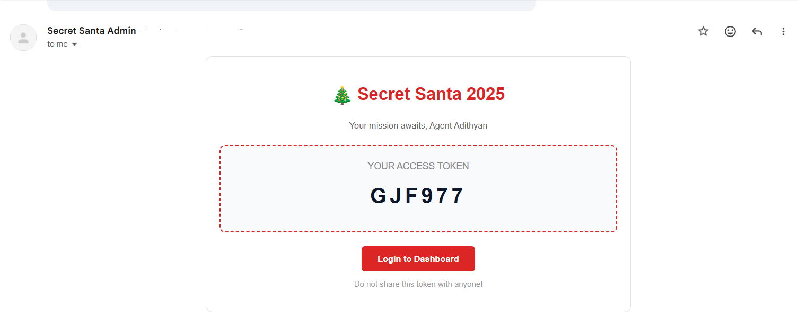
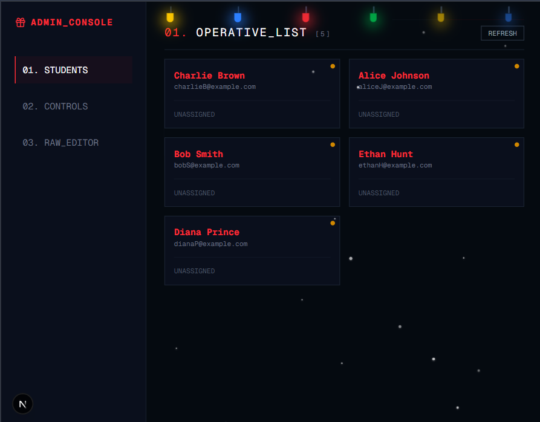

# 🎅 TokenSanta - College Edition 2025


> A secure, AI-powered Secret Santa experience designed for college campuses. No more paper chits—just tokens, vibes, and automated matchmaking.

## 📖 Overview
**TokenSanta** is a modern web application built with **Next.js** and **Firebase** that modernizes the traditional Secret Santa game. Instead of drawing names from a hat, students use unique **Access Tokens** to log in, take a personality quiz, and get matched with a target.

The system uses **Groq (Llama 3)** to analyze quiz answers and generate witty, mysterious "Vibe Clues" so users can buy gifts based on personality rather than just a name.

---

## 🚀 How It Works

### 1. The Student Flow
1.  **Login:** Students receive a unique 6-character token via email. They use this to unlock the app.
2.  **The Vibe Check:** Users take a fun, college-themed personality quiz (e.g., *"What's your attendance strategy?"*).
3.  **AI Profiling:** The system generates unique **#Tags** and **Mystery Clues** based on their answers.
4.  **The Mission:** Users enter the "Mission Hub" where they see their target's clues (Identity is **CLASSIFIED**).
5.  **The Reveal:** On the event date (e.g., Dec 25th), the countdown ends, and the target's identity is revealed!

### 2. The Matching Logic (Fisher-Yates Shuffle)
To ensure fair and collision-free pairings, the admin route uses the **Fisher-Yates Shuffle** algorithm:
1.  **Fetch:** The system retrieves all registered users from Firebase.
2.  **Shuffle:** It randomly shuffles the array of users, ensuring a completely unbiased order every time.
3.  **Link:** It creates a circular linked list (User A ➔ User B ➔ User C ➔ ... ➔ User A).
    * This guarantees that **everyone gets a gift**.
    * It prevents anyone from being assigned to themselves.
    * It ensures no sub-loops (e.g., A ➔ B and B ➔ A) unless there are only 2 players.

---

## 🕹️ The Admin Command Center

Gone are the days of manual API calls. The **Admin Dashboard** is a fully responsive, secured "Mission Control" interface designed for mobile and desktop. It features a Cyberpunk/Hacker aesthetic to match the secrecy of the event.

### Dashboard Features

1.  **Operative List (Users Tab):**
    
    * **Real-time Roster:** View all registered "Elves" and their status.
    * **Live Status Indicators:** Instantly see who has registered (Green) and who is still pending (Yellow).
    * **Match Verification:** Visual confirmation (Green Dot) when a target has been successfully assigned to a user.

2.  **System Controls (Controls Tab):**

    * **Global Reveal Timer:** Set the exact ISO timestamp for when the "Reveal" page unlocks for all students.
    * **Match Algo Trigger:** One-click execution of the Fisher-Yates matching engine.
    * **Dispatch Protocol:** Triggers the Nodemailer pipeline to blast emails with access tokens.

3.  **Raw Data Editor (Data Tab):**


    * **JSON Manifest:** Full read/write access to the student list JSON before seeding.
    * **Factory Reset:** A "Nuclear Option" to wipe the Firestore database and re-seed it from the editor's current state.

---

---

## 📸 User Interface

| **The Gatekeeper (Login)** | **The Vibe Quiz** |
|:---:|:---:|
|  |  |
| *Secure Token Entry* | *AI-Powered Profiling* |

| **Mission Hub (Classified)** | **The Reveal** |
|:---:|:---:|
|  |  |
| *View Clues & Tags* | *Identity Unlocked!* |

| **The Invitation (Email)** | **Admin Mobile View** |
|:---:|:---:|
|  |  |
| *Secure Token Delivery via Gmail* | *Responsive Admin Panel* |

---

## 🛠️ Tech Stack

* **Framework:** [Next.js 14](https://nextjs.org/) (App Router)
* **Language:** TypeScript
* **Database:** Firebase Firestore
* **Styling:** Tailwind CSS + Shadcn UI
* **AI Engine:** Groq SDK (Llama 3.3)
* **Email Service:** Nodemailer (Gmail SMTP)
* **Animations:** Lucide React, CSS Keyframes, React Snowfall

---

## ⚡ Getting Started

1.  **Clone the repository**
    ```bash
    git clone [https://github.com/sinlessrook/token-santa.git](https://github.com/sinlessrook/token-santa.git)
    cd token-santa
    ```

2.  **Install Dependencies**
    ```bash
    npm install
    ```

3.  **Set up Environment Variables**
    Create a `.env.local` file in the root directory and add the following keys. 
    
    *Note: The `NEXT_PUBLIC_` keys are required for the frontend to connect to Firebase.*

    ```env
    # --- FIREBASE CONFIG ---
    NEXT_PUBLIC_FIREBASE_API_KEY=your_api_key
    NEXT_PUBLIC_FIREBASE_AUTH_DOMAIN=your-project.firebaseapp.com
    NEXT_PUBLIC_FIREBASE_PROJECT_ID=your-project-id
    NEXT_PUBLIC_FIREBASE_STORAGE_BUCKET=your-project.appspot.com
    NEXT_PUBLIC_FIREBASE_MESSAGING_SENDER_ID=your_sender_id
    NEXT_PUBLIC_FIREBASE_APP_ID=your_app_id

    # --- AI CONFIG (Groq) ---
    GROQ_API_KEY=gsk_your_groq_api_key_here

    # --- ADMIN SECRETS ---
    ADMIN_SECRET=MySuperSecretPassword123

    # --- EMAIL SERVICE (Gmail) ---
    EMAIL_USER=your_email@gmail.com
    EMAIL_PASS=your_app_password
    ```

4.  **Run the Server**
    ```bash
    npm run dev
    ```

---

## 🤝 Contributing
Contributions are always welcome! If you have ideas for cooler animations, better quiz questions, or stronger security:

1.  Fork the Project
2.  Create your Feature Branch (`git checkout -b feature/AmazingFeature`)
3.  Commit your Changes (`git commit -m 'Add some AmazingFeature'`)
4.  Push to the Branch (`git push origin feature/AmazingFeature`)
5.  Open a Pull Request

---

## ❤️ Credits

Made with love by **Adithyan**.

> *"May your code be bug-free and your gifts be awesome."* 🎄